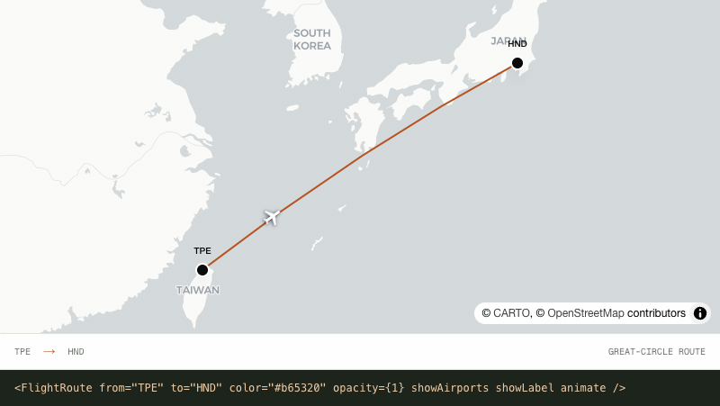
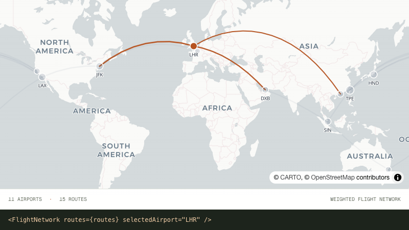
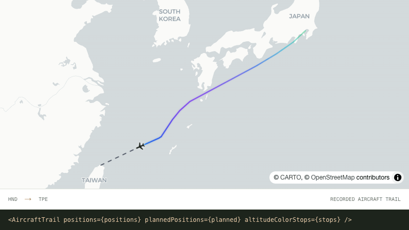

<h1 align="center">Beautiful flight visualizations for React.</h1>

<p align="center">
  Routes, live tracking, networks, trails and satellite orbits — built with MapLibre and mapcn.
</p>

<p align="center">
  <a href="https://github.com/ridemountainpig/flightcn/stargazers"></a>
  <a href="./LICENSE"></a>
</p>

<p align="center">
  <a href="https://flightcn.yencheng.dev/docs/flight"></a>
  <a href="https://flightcn.yencheng.dev/playground"></a>
  <a href="https://flightcn.yencheng.dev/satellite-playground"></a>
  <a href="https://flightcn.yencheng.dev/blocks"></a>
  <a href="https://flightcn.yencheng.dev/#showcase"></a>
</p>

```bash
npx shadcn@latest add @flightcn/flight
```

<p align="center">
  
</p>

flightcn gives you flight visualization components you own. Start with two IATA codes, add airport labels, animate an aircraft, or build a complete route network.

## Highlights

- Built to work with `mapcn`
- Type-compatible with both maplibre-gl v5 and v6
- Render airports and routes directly from IATA codes like `TPE`, `HND`, and `LAX`
- Great-circle arc rendering with antimeridian handling
- Support for single routes, multiple routes, and multi-leg journeys
- Controlled live-flight tracking with completed and remaining route segments
- Weighted flight networks, geodesic range bands, and route annotations
- Recorded aircraft trails with recent-position emphasis and animated traffic flow
- Globe-based satellite orbit overlays with ground tracks and animated markers
- Custom satellite SVG marker support for orbital visualizations
- Optional airport labels, hover states, and route animation
- Built-in airport registry with `code`, `name`, `city`, `country`, `latitude`, and `longitude`
- 11 prebuilt blocks — dashboards, route pickers, traffic flows, and orbit trackers — installable with one shadcn command
- Interactive [playground](https://flightcn.yencheng.dev/playground) for composing visualizations and copying the generated React code

## Install

### Flight

Add the flight components from the shadcn registry:

```bash
npx shadcn@latest add @flightcn/flight
```

The registry item depends on `mapcn`, so the required `map` component will also be pulled in through the registry dependency chain.

Installed files:

- `components/ui/flight.tsx`
- `components/ui/flight-airports.ts`
- `components/ui/flight-airports-utils.ts`
- `components/ui/flight-visualizations.tsx`

### Satellite

Add the satellite overlay component from the shadcn registry:

```bash
npx shadcn@latest add @flightcn/satellite
```

Installed files:

- `components/ui/satellite-orbit.tsx`

## Quick Start

After installing from the shadcn registry, import the generated local `Map` and `FlightRoute` components, then render a route with airport markers:

```tsx
import { Map } from "@/components/ui/map";
import { FlightRoute } from "@/components/ui/flight";

export default function Demo() {
  return (
    <div className="h-screen w-screen">
      <Map className="h-full w-full" center={[121.5, 25]} zoom={3}>
        <FlightRoute from="TPE" to="LAX" showAirports showLabel />
      </Map>
    </div>
  );
}
```

## Components

### `FlightAirport`

Render a single airport marker from an IATA code or custom coordinates.

### `FlightRoute`

Render one route between two airports. Use this for the common point-to-point case.

### `FlightRoutes`

Render multiple independent routes in one map. Use this when each route should remain separate.

### `FlightMultiRoute`

Render a single journey across multiple waypoints. Use this when one trip should connect several legs in sequence.

### `FlightTracker`

Track one flight with controlled progress, split completed/remaining paths, aircraft heading, and operational details.

### `FlightRouteLabel`

Place fixed labels at a percentage along a great-circle route, or use `mode="aircraft"` to show a plane with a horizontal label that follows it along the route. Supports optional route-aligned rotation and `sm`, `md`, or `lg` sizing.

### `FlightNetwork`



Render a weighted airport network with scalable routes and nodes plus connected-route focus interactions. Each route's optional `value` is a relative weight: higher values produce thicker routes and contribute more to the size of both connected airport nodes. It defaults to `1`.

### `FlightRange`

Draw one or more true geodesic distance bands from an airport or coordinate. Use a globe projection for long ranges when geographic shape matters; Mercator intentionally distorts high-latitude circles.

### `AircraftTrail`



Draw ordered recorded positions as a fading actual flight path with a current-aircraft marker, optional smooth `altitudeColorStops`, and a dashed continuation to a destination or explicit planned waypoints. Automatic destination routes support adjustable `plannedCurvature`.

### `FlightFlow`

Show multiple aircraft sharing weighted routes as either a live animated traffic flow or a static traffic snapshot. Route `value` controls relative aircraft density, while an optional per-route `aircraftCount` sets an exact count.

### `SatelliteOrbit`

Render a single globe-based orbital path with an animated satellite marker, ground track, and optional custom SVG icon.

### `SatelliteOrbits`

Render multiple orbital overlays from one dataset while sharing animation, connector, and label behavior.

## Blocks

Prebuilt, full-page examples composed from flightcn components. Browse them at [flightcn.yencheng.dev/blocks](https://flightcn.yencheng.dev/blocks), then install any block with the shadcn CLI:

```bash
npx shadcn@latest add @flightcn/flight-tracker-dashboard
```

| Block                       | Description                                                                                                |
| --------------------------- | ---------------------------------------------------------------------------------------------------------- |
| `flight-route-picker`       | Search airports, explore featured routes, and arrange multi-stop journeys with distance and time estimates |
| `flight-tracker-dashboard`  | Live flight progress beside an operations card with altitude, speed, and a playback scrubber               |
| `airline-network-dashboard` | Weighted hub-and-spoke network with a ranked destination sidebar and two-way highlighting                  |
| `airport-search-map`        | Searchable panel over the built-in airport database with fly-to markers                                    |
| `aircraft-trail-replay`     | Recorded track replay with an altitude-graded trail and dashed planned continuation                        |
| `flight-ops-overview`       | Operations dashboard with live KPI cards, a multi-flight map, and an en-route sidebar                      |
| `live-traffic-flow`         | Animated aircraft flowing along weighted global corridors with density presets                             |
| `departures-board`          | Status-filterable departure list that draws the selected flight on the map                                 |
| `aircraft-range-explorer`   | Compare aircraft reach from a departure airport with labeled range boundaries                              |
| `network-coverage-grid`     | Region-filtered coverage map with two-way selection between stat cards and markers                         |
| `satellite-orbit-tracker`   | Multi-satellite constellation on a globe with visibility toggles and orbital metadata                      |

## Playground

Compose visualizations live at [flightcn.yencheng.dev/playground](https://flightcn.yencheng.dev/playground) — stack routes, trackers, networks, and trails on one map, tune every prop, and copy the generated React code. Share any composition with a copyable view-only link, or tune orbits in the [satellite playground](https://flightcn.yencheng.dev/satellite-playground).

## Airport Data

The built-in dataset is sourced from [OurAirports](https://ourairports.com/data/) and bundled locally in this project.

Current `AirportInfo` fields:

- `code`
- `name`
- `city`
- `country`
- `latitude`
- `longitude`

## Docs

- Flight docs: [flightcn.yencheng.dev/docs/flight](https://flightcn.yencheng.dev/docs/flight)
- Satellite docs: [flightcn.yencheng.dev/docs/satellite](https://flightcn.yencheng.dev/docs/satellite)
- Flight install guide: [flightcn.yencheng.dev/docs/install/flight](https://flightcn.yencheng.dev/docs/install/flight)
- Satellite install guide: [flightcn.yencheng.dev/docs/install/satellite](https://flightcn.yencheng.dev/docs/install/satellite)
- Blocks: [flightcn.yencheng.dev/blocks](https://flightcn.yencheng.dev/blocks)
- Playground: [flightcn.yencheng.dev/playground](https://flightcn.yencheng.dev/playground)
- Satellite playground: [flightcn.yencheng.dev/satellite-playground](https://flightcn.yencheng.dev/satellite-playground)
- Registry homepage: [flightcn.yencheng.dev](https://flightcn.yencheng.dev)

## Local Development

For local development:

```bash
pnpm install
pnpm dev
```

Useful commands:

```bash
pnpm lint
pnpm build
pnpm registry:build
pnpm format
```

## License

MIT License - see the [LICENSE](LICENSE) file for details.
